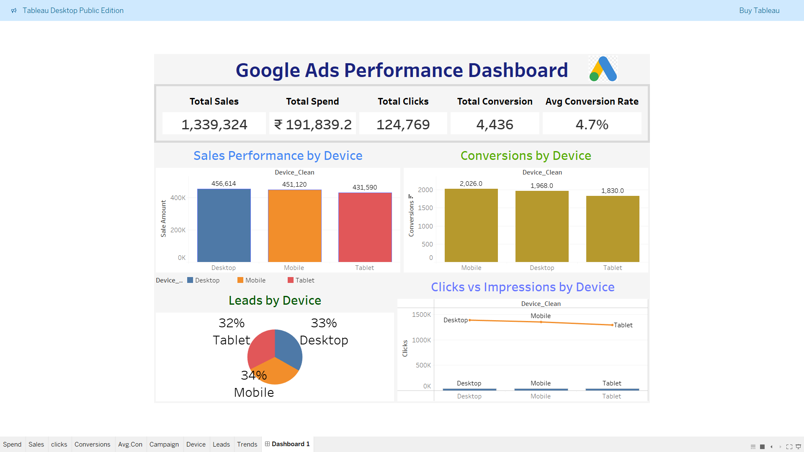

# 📊 Google Ads Analysis using Python & Tableau

  

## 🧭 Project Overview
This project focuses on analyzing **Google Ads campaign data** to evaluate digital marketing performance and uncover actionable insights.  
Python was used for **data cleaning and exploratory data analysis (EDA)**, and the processed data was visualized using an **interactive Tableau dashboard** for effective business storytelling.

---

## 🎯 Project Objectives
- 📈 Analyze campaign performance and marketing effectiveness  
- 💰 Evaluate ad spend, sales, and conversion metrics  
- 📱 Compare device-wise and location-wise performance  
- 🧠 Support data-driven decision-making for campaign optimization  

---

## 🗂️ Dataset Description
The dataset includes the following key attributes:

- 🆔 **Ad_ID**
- 🎯 **Campaign_Name**
- 🖱️ **Clicks**
- 👁️ **Impressions**
- 💸 **Cost**
- 🧲 **Leads**
- 🔄 **Conversions**
- 📊 **Conversion Rate**
- 💵 **Sale_Amount**
- 📅 **Ad_Date**
- 📍 **Location**
- 📱 **Device**
- 🔑 **Keyword**

---

## 🧹 Data Cleaning Process
- 🧩 Handled missing values and invalid entries  
- 🔢 Corrected incorrect data types (numeric & date columns)  
- 🧮 Recalculated conversion rates for accuracy  
- 🏷️ Standardized categorical values (e.g., location name corrections)  
- 🗑️ Removed duplicate and inconsistent records  

---

## 🔍 Exploratory Data Analysis (EDA)
- 📊 Campaign-wise sales and conversion analysis  
- 📱 Device-wise performance comparison  
- 📍 Location-based revenue insights  
- 🔑 Keyword performance evaluation  
- ⏳ Time-series analysis of sales trends  
- 🔗 Correlation analysis between cost, clicks, and conversions  

---

## 📌 Key Performance Indicators (KPIs)
- 💰 **Total Spend:** ₹191,839.15  
- 💵 **Total Sales:** ₹1,339,324  
- 🖱️ **Total Clicks:** 124,769  
- 🔄 **Total Conversions:** 5,824  
- 📈 **Average Conversion Rate:** 4.97%  

---

## 📊 Tableau Dashboard

### 🔍 Dashboard Highlights
- 📌 KPI overview (Spend, Sales, Clicks, Conversions, Conversion Rate)  
- 🎯 Campaign-wise performance  
- 📱 Device & 📍 location-based insights  
- 📅 Time-based sales trends  

### 🖼️ Dashboard Preview

Add screenshot here

🛠️ Tools & Technologies

🐍 Python (Pandas, NumPy, Matplotlib, Seaborn)

📓 Jupyter Notebook

📊 Tableau

📁 CSV

## 📁 Project Structure

google-ads-analysis/

│

├── Google_Ads_Analysis.ipynb

├── google_ads_cleaned_data.csv

├── images/

│ └── google_ads_tableau_dashboard.png

└── README.md

💡 Key Insights

📱 Mobile devices generated the highest conversions

🎯 Certain campaigns delivered high revenue with optimized spend

⚖️ Higher ad spend does not always guarantee higher conversions

🧹 Data standardization improved analysis accuracy

🔗 Project Links
📓 Jupyter Notebook: Google_ads/Google_Ads_Analysis.ipynb

📊 Tableau Dashboard: Screenshot 2025-12-20 131357.png

